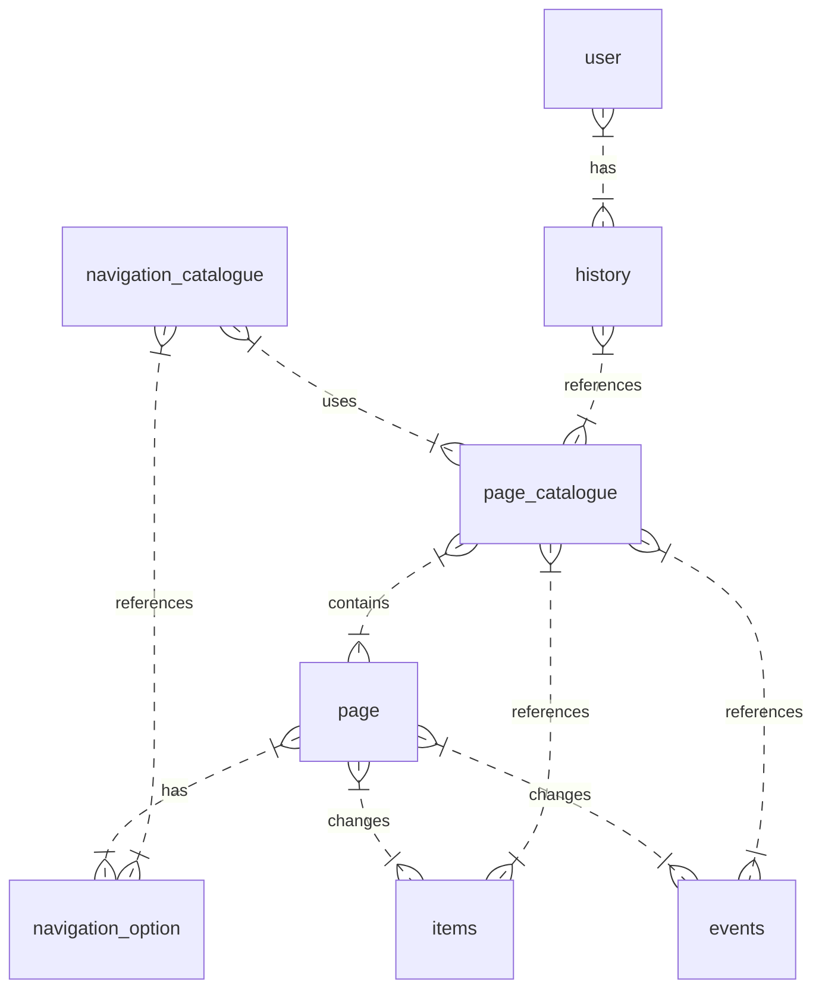

# Database Tables

* page - Contains the content of a page
* navigation_option
  * Each option belongs to a specific page and references to a single page
* items
* events
* page_catalogue - manages keys and content/option linking. 
Contains text fields for list of events and items
  * key: String
  * events: `eventA,eventB,eventE`
  * items: `itemA*amount,itemC*amount`
* navigation_index
  * source: String (key), primary mit target
  * target: String (key), primary mit source
  * navigation_option_id
* user
* history

