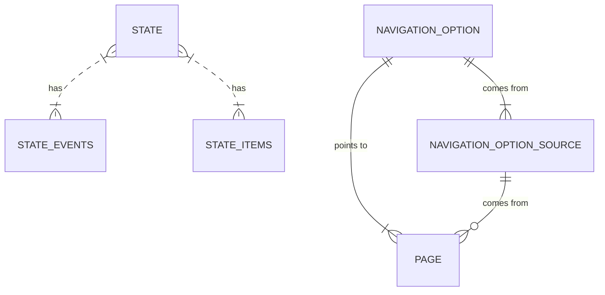

# Documentation

## Concept

The main idea of this project is to provide the infrastructure for a CYOA type of story.

The following terminology is used:

| Name              | Description                                                                                                                                                       |
|-------------------|-------------------------------------------------------------------------------------------------------------------------------------------------------------------|
| Page              | Construct that bundles the view of the user. Contains a text that will be shown and a delta, which will be applied when the page is opened.                       |
| Navigation Option | A link between two pages (source page and target page), describes with a text. This emulates the "If you want to do this, go to page X" options in classic books. |
| Event             | Marks that the character visited a certain point during their journey. Can be used as condition for navigation options.                                           |
| Item              | Collection of string-integer pairs. Notes that the character "owns" the given amount for a type (e.g. "10 gold"). Can be used as condition for navigation options |

## Data Model

The two most important entities are pages and states.
They are not related, but can be combined.
The content (items, events) of a state has an effect on the options that will be available
for a given page. Similar, a pages delta will update the state that is attached.

See [PageStateFlow](design_decisions/adr_0001_stateless_flow/PageStateFlow.md) for more information.

## Building your own stories

To build your own story, you need to create the following entities in the database:
* pages
* navigation options
* navigation option sources

For an example on how to use these, take a look at the [sample content](../src/test/resources/sql/sample_content.sql).