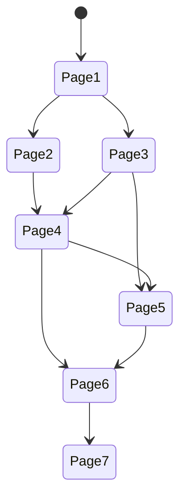

There are two concepts being combined for the flow: 
- The page (and its content)
- The current state (the combination of events and items)

There are also users, but since a user does not have impact on the flow, we will ignore that in the scope of this document.

While each page only knows about the IDs of the pages that follow up (via their navigation options), 
the state is transferred between pages and has influence on its content (e.g. the available options).

Let's take a look at an example flow. We have six pages with their IDs (1 to 6). 
Ignoring conditions, the following paths are possible:

Now assume we have two events `A` and `B` that can be either `true` or `false` and are `false` by default. 
If the path from `Page1` to `Page6` traverses `Page2`, `A` will be `true`.
If the path traverses `Page5`, `B` will be `true`.
The edge between 4 and 5 will only be available, if `A` is `true`.

The initial request would call `1.1` - the first part references `Page1`, the second points to the database entry
that lists both events as `false`. The user decides to take the edge to `Page2`. 
The reference is `2.1` - but once `Page2` is loaded, a new entry for the state is created with `A=true,B=false`. 
The outgoing link from `Page2` would be `4.2`, it is created when the content of `Page2` is fetched.

Following that route, on `Page4` the options are `5.2` and `6.2`, because the state does not change on `Page4`.
On `Page5` the state changes, meaning on `Page6` there are two possibilities:
- The user took the route over `Page4` and `Page5`. Then the link to `Page7` is `7.3`
- The user got to `Page6` directly from `Page4`. Then the link to `Page7` is `7.2`