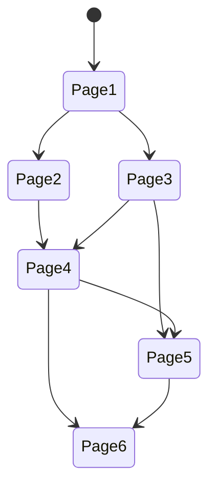

There are two concepts being combined for the flow: 
- The page (and its content)
- The current state (the combination of events and items)

While each page only knows about the IDs of the pages that follow up, the state is transferred between pages
and has influence on its content (e.g. the available options).

Let's take a look at an example flow. We have six pages with their IDs (1 to 6). 
Ignoring conditions, the following paths are possible:

Now assume we have two events `A` and `B` that can be either `true` or `false` and are `false` by default. 
If the path from `Page1` to `Page6` traverses `Page2`, `A` will be `true`.
If the path traverses `Page5`, `B` will be `true`.
The edge between 4 and 5 will only be available, if `A` is `true`.

The initial request would call `1.0` - the first part references `Page1`, the second points to the database entry
that lists both events as `false`. The user decides to take the edge to `Page2`. 
The reference is `2.0` - but once `Page2` is loaded, a new entry for the state is created with `A=true,B=false`. 
The outgoing links from `Page2` would be `4.1`, they are created when the content of `Page2` is fetched.